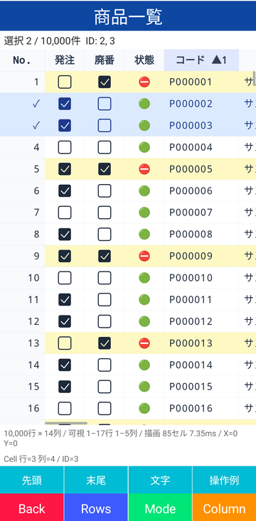
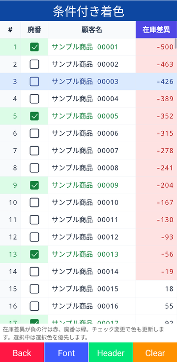
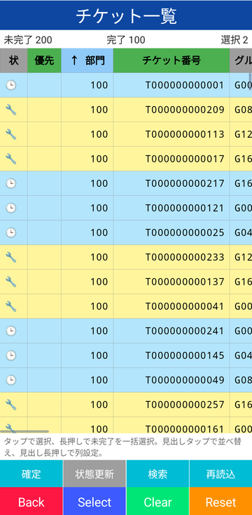

# ClamGrid - MAUI grid view rendered with SkiaSharp

[](https://www.nuget.org/packages/ClamGrid/)

## 🐚 What is this?

A .NET MAUI grid view for Android that draws cells with SkiaSharp.
Layout, sorting, selection and touch handling are implemented in C#, so the grid stays responsive with tens of thousands of rows.

| 🖱 Selection, sorting and boolean editing | 🎨 Conditional colors | 🧾 Columns declared in XAML |
|:-:|:-:|:-:|
|  |  |  |

## 🚀 Quick Start

Call `UseSkiaSharp()` when building the application.

```csharp
var builder = MauiApp.CreateBuilder()
    .UseMauiApp<App>()
    .UseSkiaSharp();
```

Define columns with typed value accessors and connect a data view.

```csharp
var grid = new ClamGridView();
grid.ConfigureColumns(
[
    new GridColumn("name", "Name", new GridValueAccessor<Customer, string>(static x => x.Name)) { Width = GridColumnWidth.Star(), MinWidth = 120 },
    new GridColumn("number", "Number", new GridValueAccessor<Customer, int>(static x => x.Number)) { Width = GridColumnWidth.Absolute(160), Alignment = TextAlignment.End, Format = "N0" },
    new GridColumn("done", "Done", new GridValueAccessor<Customer, bool>(static x => x.IsDone, static (x, value) => x.IsDone = value)) { IsBoolean = true, IsReadOnly = false }
]);

// Customer.Id is a unique and immutable key
var view = new GridDataView<Customer>(customers, static x => x.Id);
view.RegisterSort("name", static x => x.Name, StringComparer.CurrentCulture);
view.RegisterSort("number", static x => x.Number, StringComparer.Ordinal);

grid.ItemsSource = view;
grid.SelectionMode = GridSelectionMode.MultipleToggle;
grid.CellTapped += (_, e) => Debug.WriteLine(e.Hit);
```

Columns can also be declared in XAML. Columns without a `ValueAccessor` are resolved by `Key` from `ValueAccessors`, so the value access stays typed and trimming safe.

```xml
<clam:ClamGridView ItemsSource="{Binding Customers}"
                   ValueAccessors="{x:Static local:Customer.Accessors}"
                   ColumnOrders="{Binding ColumnOrders}"
                   SelectionMode="MultipleToggle">
    <clam:GridColumn Key="name" Header="Name" Width="*" MinWidth="120" />
    <clam:GridColumn Key="number" Header="Number" Width="160" Alignment="End" Format="N0" />
    <clam:GridColumn Key="done" Header="Done" IsBoolean="True" IsReadOnly="False" />
</clam:ClamGridView>
```

```csharp
// Customer.Accessors
public static GridValueAccessorCollection<Customer> Accessors { get; } = new()
{
    { "name", static x => x.Name },
    { "number", static x => x.Number },
    { "done", static x => x.IsDone, static (x, value) => x.IsDone = value }
};
```

`Format` applies a .NET format string (`N0`, `yyyy/MM/dd` and so on) to `IFormattable` cell values; strings and booleans are shown as they are.

`GridStyle` can be a XAML resource as well (`<clam:GridStyle x:Key="ListStyle" FontFamily="monospace" ShowRowHeaders="False" />`). Treat a style as immutable once assigned and replace it with a `with` expression to change it.
The sort indicator of a header is text: `AscendingSortMark` / `DescendingSortMark` (`↑` / `↓` by default) can be any string such as `▲`, `SortMarkPosition="End"` places it after the header text, and `ShowSortPriority` also marks secondary sort keys with their priority (`▲2`).

The grid scrolls by itself, so place it where it receives a definite size (for example a `*` row of a `Grid`).
Tapping a column header sorts by the registered key, tapping a row toggles the selection, and a long press selects or clears all rows.

## 🔗 Binding and MVVM

Everything a view model needs is a bindable property or a command, so a screen can be declared in XAML without code-behind. `Example/Modules/Ticket` together with `Example/Modules/Parts/TicketGrid.xaml` is a complete screen built this way.

```xml
<clam:ClamGridView ItemsSource="{Binding Items}"
                   ValueAccessors="{x:Static models:TicketRowAccessors.Ticket}"
                   ColumnOrders="{Binding ColumnOrders}"
                   SortOrders="{Binding SortOrders}"
                   GridStyle="{StaticResource ListGridStyle}"
                   SelectionMode="MultipleToggle"
                   SelectAllCommand="{Binding SelectCommand}"
                   ColumnConfigurationCommand="{Binding ColumnEditCommand}">
    <clam:GridColumn Key="StatusMark" Header="Status" Width="45" AllowSorting="False" />
    <clam:GridColumn Key="ReceiptOrder" Header="Order" Width="95" Format="D6" />
    <clam:GridColumn Key="StartedDate" Header="Started" Width="80" Format="MM/dd" />
</clam:ClamGridView>
```

```csharp
public sealed class TicketListViewModel : ObservableObject
{
    private readonly IColumnSettingsStore store;

    // Rows, selection and sort state in one object
    public GridDataView<TicketRow> Items { get; } = new(Array.Empty<TicketRow>(), static x => x.Id);

    // TwoWay bound: the grid writes the normalized orders back, so persisting them in the setter is enough
    public IReadOnlyList<GridColumnOrder>? ColumnOrders
    {
        get;
        set
        {
            field = value;
            OnPropertyChanged();
            if (value is not null)
            {
                store.Save("columns", value);
            }
        }
    }

    // TwoWay bound as well: the grid writes the applied sort back after a header tap
    public IReadOnlyList<GridSortOrder>? SortOrders
    {
        get;
        set
        {
            field = value;
            OnPropertyChanged();
        }
    }

    public ICommand SelectCommand { get; }

    public ICommand ColumnEditCommand { get; }

    public TicketListViewModel(IColumnSettingsStore store)
    {
        this.store = store;
        ColumnOrders = store.Load("columns");
        SortOrders = [new GridSortOrder("ReceiptOrder")];
        Items.RegisterSort("ReceiptOrder", static x => x.ReceiptOrder);
        // Long press on a row: true selects, false clears
        SelectCommand = new Command<bool>(select => Items.UpdateSelection(x => select && !x.IsCompleted));
        // Long press on a header: open a settings page with an editable copy, assign session.Export() to ColumnOrders on return
        ColumnEditCommand = new Command<GridColumnConfigurationEventArgs>(e => OpenColumnSettings(e.CreateEditSession()));
    }
}
```

| Task | Binding |
|---|---|
| Rows | Bind `ItemsSource` to a `GridDataView<T>`. It owns the rows, selection and sort state and raises `PropertyChanged` for `Count`, `SelectedCount`, `SelectedItems` and `SortOrders`, so labels and command states can follow it. Any other `IEnumerable` also works and is wrapped in an owned view. |
| Columns | Declare `GridColumn` children in XAML and bind `ValueAccessors` to a static `GridValueAccessorCollection<T>`. Values stay typed, no reflection is involved, and `Format` / `Alignment` are declared per column. |
| Column settings | Bind `ColumnOrders` (`TwoWay` by default). Load the saved value into the property and save it in the setter; `null` restores the default and the grid writes the normalized value back. A long press on a header runs `ColumnConfigurationCommand` with `GridColumnConfigurationEventArgs`; `CreateEditSession()` returns an editable copy for a settings page and `Export()` on the session returns the orders to assign back. |
| Sort state | Bind `SortOrders` (`TwoWay` by default) and register the keys on the data view (`RegisterSort`, `RegisterComparer` or `SetSortCallback`). A header tap calls `SortBy` and the applied state is written back, so persisting it in the setter is enough; `SaveSortOrders()` / `RestoreSortOrders()` remain for code driven use. |
| Selection | `SelectionMode` and `SelectAllCommand` (parameter `bool`) on the grid; `UpdateSelection(predicate)`, `SetSelected` and `TryToggleSelection` on the data view change the selection from the view model. Scrolling a row into view needs the view, so the sample bridges it with a behavior and a request object (`GridSelectBehavior` / `GridSelectRequest`). |
| Editing | `IsReadOnly` plus `CellValueChangedCommand` (or the `CellValueChanging` / `CellValueChanged` events) for boolean cells. |
| Colors | `GridStyle` as a resource. `RowBackground`, `CellColors`, `ColumnHeaderColors` and `RowHeaderColors` receive the row item, so state colors stay in the model; the sample composes them in XAML with `GridColorBehavior` and an `IColorSelector` resource. |
| Other input | `CellTappedCommand`, `CellLongPressedCommand`, `ColumnWidthChangedCommand` and `RowMovedCommand` receive the same arguments as the events. |

Messaging, navigation and screen controllers are application concerns; the library exposes bindables, commands and events only.

## ✅ Supported features

| Category | Detail |
|---|---|
| **Columns** | Auto / Absolute / Star width, minimum width, alignment, format string, static header and cell colors |
| **Column settings** | Visibility and order, edit session for a settings screen, drag to resize |
| **Data** | `INotifyCollectionChanged` / `INotifyPropertyChanged` tracking, stable row keys |
| **Sorting** | Multi-key sort with history, direction aware comparers, sort callback |
| **Selection** | None / single / multiple toggle, select all, selection by key |
| **Editing** | Boolean cell toggle |
| **Row dragging** | Reorder rows by dragging the row header |
| **Input** | Tap, long press, pan with inertia, column resize, commands for MVVM |
| **Styling** | `GridStyle` with font, padding, colors, sort marks, row header text and conditional color callbacks. Characters missing from the font (emoji and so on) fall back to the typefaces in `GridFonts.Fallbacks` and then to system fonts per character, guided by `GridFonts.Languages` |

## 📖 ClamGridView API

### 🧩 Properties

| Name | Type | Default | Description |
|---|---|---|---|
| `ItemsSource` | `IEnumerable?` | `null` | Rows. An `IGridDataView` is used as is, other sources are wrapped in an owned `GridDataView<object>`. Bindable. |
| `DataView` | `IGridDataView?` | | Data view that owns the rows, selection and sort state. |
| `Columns` | `GridColumnCollection` | | Visible columns in display order. |
| `ColumnDefinitions` | `GridColumnCollection` | | All column definitions including hidden columns. Content property, so columns can be declared as XAML children. Changes rebuild `Columns` with the current `ColumnOrders`. |
| `ValueAccessors` | `IGridValueAccessorProvider?` | `null` | Resolves the value accessor of columns declared without one by `Key`. `GridValueAccessorCollection<T>` is the typed implementation. Bindable. |
| `ColumnOrders` | `IReadOnlyList<GridColumnOrder>` | `[]` | Visibility and order of all columns. Set `null` to restore the default. The value is normalized and written back, so a `TwoWay` binding (the default) receives the normalized orders. Bindable. |
| `SortOrders` | `IReadOnlyList<GridSortOrder>` | `[]` | Sort keys and directions of the data view. Applied when set, also to a data view that arrives later, and the applied state is written back after a header tap or `SortBy`, so a `TwoWay` binding (the default) receives it. Unregistered keys are dropped, an empty list clears the sort and `null` leaves the data view unchanged. Bindable. |
| `GridStyle` | `GridStyle` | `new()` | Font, padding, sizes and colors. Bindable. |
| `SelectionMode` | `GridSelectionMode` | `MultipleToggle` | Selection behavior. Bindable. |
| `RowCount` | `int` | | Number of rows. |
| `SelectedCount` | `int` | | Number of selected rows. |
| `SelectedItems` | `IReadOnlyList<object>` | | Selected rows in display order. |
| `IsReadOnly` | `bool` | `true` | Default for boolean cell editing. `GridColumn.IsReadOnly` takes precedence. Bindable. |
| `AllowColumnResizing` | `bool` | `true` | Enables dragging the header boundary. Bindable. |
| `AllowColumnConfiguration` | `bool` | `true` | Enables the column configuration request by a long press on a header. Bindable. |
| `AllowRowDragging` | `bool` | `false` | Enables row reordering by dragging the row header. Bindable. |
| `RowMover` | `IGridRowMover?` | `null` | Applies row moves to the source collection. Bindable. |
| `CellTappedCommand` | `ICommand?` | `null` | Executed after `CellTapped` with `GridCellEventArgs`. Bindable. |
| `CellLongPressedCommand` | `ICommand?` | `null` | Executed after `CellLongPressed` with `GridCellEventArgs`. Bindable. |
| `SelectAllCommand` | `ICommand?` | `null` | Replaces the default bulk selection. Parameter is `bool` (select or clear). Bindable. |
| `ColumnConfigurationCommand` | `ICommand?` | `null` | Executed after `ColumnConfigurationRequested` with `GridColumnConfigurationEventArgs`. `CreateEditSession()` on the argument creates the settings copy. Bindable. |
| `CellValueChangedCommand` | `ICommand?` | `null` | Executed after `CellValueChanged` with `GridCellValueEventArgs`. Bindable. |
| `ColumnWidthChangedCommand` | `ICommand?` | `null` | Executed after `ColumnWidthChanged` with `GridColumnWidthEventArgs`. Bindable. |
| `RowMovedCommand` | `ICommand?` | `null` | Executed after `RowMoved` with `GridRowMoveEventArgs`. Bindable. |
| `AutoMeasureRowLimit` | `int` | `32` | Number of rows measured for Auto width columns. |
| `ScrollX` | `double` | | Horizontal scroll offset in DIP. |
| `ScrollY` | `double` | | Vertical scroll offset in DIP. |
| `InputState` | `GridGestureState` | | Current gesture state. |
| `IsInertiaRunning` | `bool` | | Whether inertial scrolling is in progress. |

### 🛠 Methods

| Name | Returns | Description |
|---|---|---|
| `ConfigureColumns(IEnumerable<GridColumn> definitions, IEnumerable<GridColumnOrder>? orders = null)` | `void` | Replaces all column definitions and applies the saved visibility and order. |
| `ApplyColumnOrders(IEnumerable<GridColumnOrder>? orders)` | `void` | Applies visibility and order to the current definitions. `null` restores the default. |
| `CreateColumnEditSession()` | `GridColumnEditSession` | Creates an editable copy of the column settings. `GridColumnEditSession.Create(columns, orders)` does the same without the view. |
| `IsSelected(int rowIndex)` | `bool` | Whether the row is selected. |
| `SetSelected(int rowIndex, bool value)` | `bool` | Selects or clears the row. |
| `TryToggleSelection(int rowIndex, out bool isSelected)` | `bool` | Toggles the row selection. |
| `TryToggleSelectionByKey(object key, out bool isSelected)` | `bool` | Toggles the selection by row key and scrolls the row into view. |
| `SelectAll()` | `void` | Selects all rows. |
| `ClearSelection()` | `void` | Clears the selection. |
| `SortByColumn(int columnIndex)` | `GridSortResult` | Sorts by the column key, toggling the direction of the primary key. |
| `Refresh()` | `void` | Rebuilds the rows from the source. |
| `RefreshRows(int startIndex, int count)` | `bool` | Redraws values and colors of the rows. |
| `ScrollTo(double x, double y)` | `void` | Scrolls to the offset. |
| `ScrollBy(double x, double y)` | `void` | Scrolls by the delta. |
| `ScrollIntoView(int rowIndex, int columnIndex)` | `bool` | Scrolls until the cell is visible. |
| `HitTest(double x, double y)` | `GridHit` | Resolves the cell at the position in DIP. |
| `CancelInteraction()` | `void` | Stops the current gesture and inertia. |
| `InvalidateSurface()` | `void` | Redraws the grid. |
| `Dispose()` | `void` | Releases the data view subscriptions, timers and native resources. |

### 📣 Events

| Name | EventArgs | Description |
|---|---|---|
| `CellTapped` | `GridCellEventArgs` | Cell, header or corner tapped. Set `Handled` to suppress the command and the default action. |
| `CellLongPressed` | `GridCellEventArgs` | Cell or header long pressed. |
| `CellValueChanging` | `GridCellValueEventArgs` | Boolean cell is about to change. Cancelable. |
| `CellValueChanged` | `GridCellValueEventArgs` | Boolean cell changed. |
| `SelectionChanged` | `EventArgs` | Selection changed. |
| `SortRequested` | `GridSortRequestedEventArgs` | Sort is about to run. Cancelable. |
| `SortChanged` | `EventArgs` | Sort orders changed. |
| `SortFailed` | `GridSortFailedEventArgs` | Sort failed and the previous rows are kept. |
| `ColumnWidthChanging` | `GridColumnWidthEventArgs` | Column resize is about to be applied. Cancelable. |
| `ColumnWidthChanged` | `GridColumnWidthEventArgs` | Column width changed. |
| `ColumnConfigurationRequested` | `GridColumnConfigurationEventArgs` | Column configuration requested by a long press on a header. |
| `RowMoveRequested` | `GridRowMoveEventArgs` | Row drag is about to be applied. Cancelable. |
| `RowMoved` | `GridRowMoveEventArgs` | Row moved. |
| `FrameRendered` | `GridFrameEventArgs` | Render statistics of a frame. |

## 📐 GridColumn

| Name | Type | Default | Description |
|---|---|---|---|
| `Key` | `string` | `""` | Identifier used by `ColumnOrders`, `ValueAccessors` and sorting. Required and unique. |
| `Header` | `string` | `""` | Header text. |
| `ValueAccessor` | `IGridValueAccessor` | unresolved | Typed getter and optional setter (`GridValueAccessor<T, TValue>`). A column declared without one is resolved by `Key` from `ValueAccessors`. |
| `Width` | `GridColumnWidth` | `Auto` | `Auto`, `Absolute(dip)` or `Star(weight)`; in XAML `Auto`, `85`, `*` or `2*`. |
| `MinWidth` | `double` | `40` | Lower bound for resizing and star distribution. |
| `Alignment` | `TextAlignment` | `Start` | Cell text alignment. |
| `Format` | `string?` | `null` | .NET format string applied to `IFormattable` values (`N0`, `D6`, `yyyy/MM/dd`). |
| `HeaderBackground`, `HeaderTextColor`, `TextColor`, `Background` | `Color?` | `null` | Static colors; `null` falls back to `GridStyle`. |
| `IsBoolean` | `bool` | `false` | Draws a check box and toggles the value on tap. |
| `IsReadOnly` | `bool?` | `null` | Overrides `ClamGridView.IsReadOnly` for the column. |
| `SortKey` | `string?` | `null` | Sort key registered on the data view when it differs from `Key`. |
| `AllowSorting` | `bool` | `true` | A header tap sorts the column. |
| `AllowResizing` | `bool` | `true` | The header boundary can be dragged. |

## 🎨 GridStyle

| Name | Type | Default | Description |
|---|---|---|---|
| `FontFamily` | `string` | `monospace` | Primary font. Characters it lacks are resolved through `GridFonts`. |
| `FontSize` | `float` | `16` | Font size in DIP. |
| `HorizontalPadding`, `VerticalPadding` | `float` | `8` | Cell padding in DIP. |
| `RowHeight`, `HeaderHeight` | `double?` | `null` | `null` derives the height from the font. |
| `RowHeaderWidth` | `double` | `48` | Width of the row header. |
| `ShowColumnHeaders`, `ShowRowHeaders`, `ShowVerticalLines` | `bool` | `true` | Visibility of the headers and vertical lines. |
| `CornerText` | `string` | `#` | Text of the corner cell above the row headers. |
| `RowHeaderAlignment` | `TextAlignment` | `End` | Alignment of the row header text. |
| `TextColor`, `Background`, `HeaderBackground`, `HeaderTextColor`, `RowHeaderBackground`, `GridLineColor`, `SelectedBackground`, `SelectedTextColor` | `Color` | | Base colors. |
| `AscendingHeaderBackground`, `DescendingHeaderBackground` | `Color` | | Header background of the primary sort key. |
| `AscendingSortMark`, `DescendingSortMark` | `string` | `↑`, `↓` | Text drawn next to the header of a sorted column. The mark is kept when the header text has to be truncated. |
| `SortMarkPosition` | `GridSortMarkPosition` | `Start` | `Start` draws the mark before the header text, `End` after it. |
| `ShowSortPriority` | `bool` | `false` | With several sort keys, marks the secondary keys too and appends the priority (`▲2`). |
| `RowBackground` | `Func<object, Color?>?` | `null` | Row background by item. |
| `RowHeaderText` | `Func<GridRowHeaderTextContext, string?>?` | `null` | Row header text by item and selection state; `null` falls back to the row number. |
| `CellColors`, `ColumnHeaderColors`, `RowHeaderColors` | callback | `null` | Per cell and per header colors; the context carries the item, the column, the sort state and the default colors. |

## 🔤 GridFonts

Global font fallback settings. They are read when a grid creates its renderer, so set them at startup, before the first grid is shown.

| Name | Type | Default | Description |
|---|---|---|---|
| `Languages` | `IReadOnlyList<string>` | `["ja"]` | BCP-47 tags passed to the per character system font lookup in priority order. CJK ideographs are shared by several languages, so the tag selects the glyph variant. |
| `Fallbacks` | `IReadOnlyList<SKTypeface>` | `[]` | Typefaces tried before the system lookup for characters the primary font lacks, for example a bundled font. They also count toward the automatic row height. The caller keeps ownership. |

```csharp
GridFonts.Languages = ["ja", "en"];
GridFonts.Fallbacks = [SKTypeface.FromStream(await FileSystem.OpenAppPackageFileAsync("NotoSansJP-Regular.ttf"))];
```

## 🗂 GridDataView&lt;T&gt;

| Member | Description |
|---|---|
| `GridDataView(IEnumerable source, Func<T, object?>? keySelector)` | Wraps the rows. The key keeps the selection stable across sorting and refreshes; `INotifyCollectionChanged` and `INotifyPropertyChanged` sources are tracked. |
| `Count`, `this[int]`, `SelectedCount`, `SelectedItems`, `SortOrders`, `SelectionMode` | State for binding and logic. |
| `SetSelected`, `TryToggleSelection`, `SelectAll`, `ClearSelection`, `UpdateSelection(predicate)` | Selection API. |
| `RegisterSort(key, selector, comparer)`, `RegisterComparer(key, comparison)`, `SetSortCallback(keys, callback)` | Sort key registration. The callback variant delegates the sorting itself, for example to a database query. |
| `SortBy(key)`, `RestoreSortOrders(orders)`, `SaveSortOrders()` | Sort and persist the sort state. |
| `SetSource(rows)`, `Refresh()`, `Suspend()` / `Resume()` | Replace the rows, rebuild them or batch changes. |
| `Changed`, `SelectionChanged`, `SortRequested`, `SortChanged`, `SortFailed` | Events with the same meaning as on the view. |

## 📦 Dependencies

- [SkiaSharp](https://github.com/mono/SkiaSharp)
